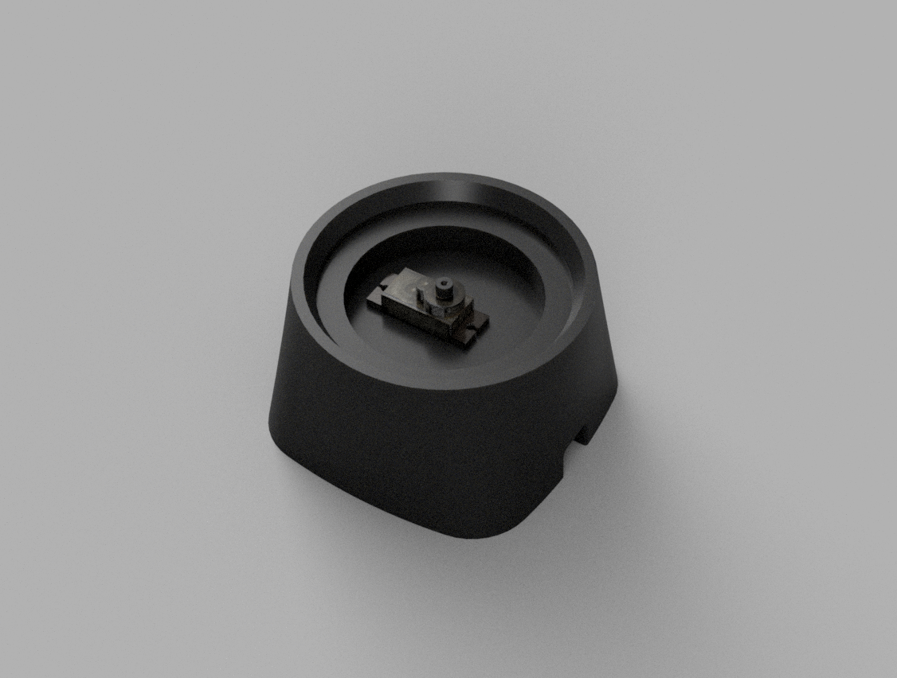
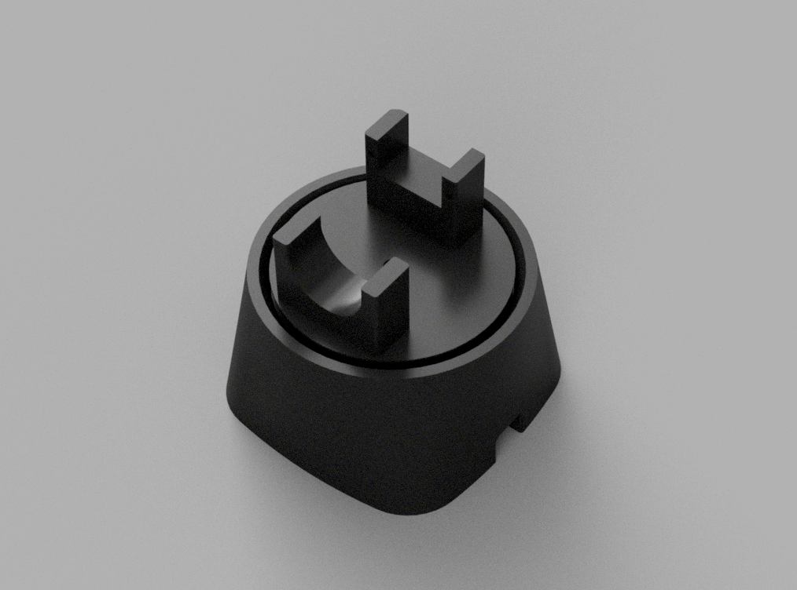
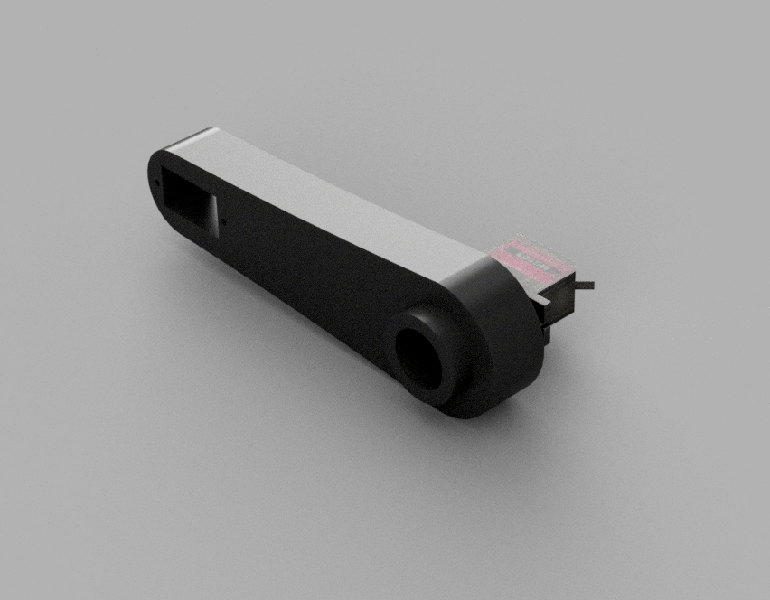
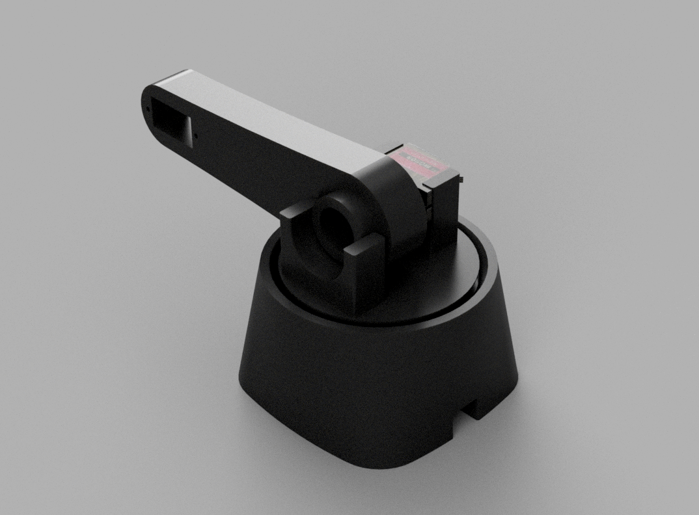
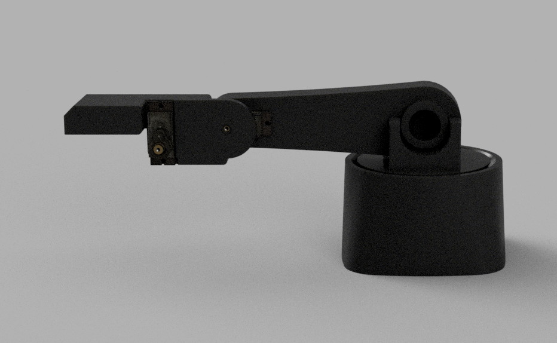
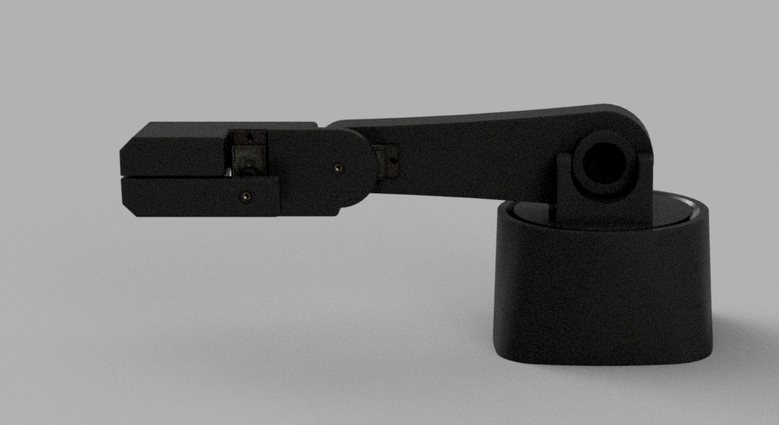

# 🦾 3-Axis Robotic Arm Controller & Simulator

A high-performance, precision-controlled 3-axis robotic arm project featuring a mathematical Inverse Kinematics (IK) engine, a robust Arduino-based servo controller with EEPROM state persistence, and interactive command-line and graphical dashboards.


> 🎬 **Demo** — [Watch smooth_glider.py in action](media/demo_smooth_glider.mov)

---


## 🌟 Key Features

* **📐 Precision Inverse Kinematics**: Custom analytical geometric IK engine solving joint coordinates in real time for precise target tracking.
* **🔌 Sub-Degree Resolution Serial Protocol**: A binary serial packet protocol scaling float angles to centidegrees (1/100th of a degree) and packing them into compact 16-bit big-endian structures for optimal transmission speed and high accuracy.
* **💾 Non-Volatile Memory (EEPROM)**: The Arduino firmware caches successful servo coordinates to the EEPROM on every valid command, preventing joint snapping/jerking when powered off and rebooted.
* **🤝 Startup Position Handshake**: On boot, the Arduino reads its last-known position from EEPROM (clamping uninitialized states to a safe $90^\circ$), moves there, and outputs an `INIT:base,bottom,top,gripper` handshake signal to coordinate seamless starting glides.
* **📈 Multi-Mode Trajectory Planners**: Supports both immediate step-coordinate jumps (`rigid_glider.py`) and joint-space linear angle interpolation (`smooth_glider.py`) for smooth path planning.
* **🛠️ 3D Printable Mechanical Assets**: CAD models (STL/3MF/F3Z formats) located in the workspace under `version_1/` for physical arm manufacturing and prototyping.

---

## 📂 Project Directory Structure

```filepath
├── README.md                           # Project documentation
├── version_1/                          # 3D printable CAD models for the arm
│   ├── 1.1/
│   ├── 1.2/                            # First printed version
│   ├── 1.3/                            # Fixes to lower arm and upper base
│   └── 1.4/                            # Latest mechanical iterations (STL, 3MF, F3Z)
│ 
└── robot_arm_controller/               # Hardware control & simulation scripts
    ├── __arm_controller_gui.py         # Pygame GUI dashboard for coordinate tracking & simulation
    ├── __go_to_angle.py                # Test script for direct raw angle command writes
    ├── angle_tui.py                    # Interactive joint-space console CLI (TUI)
    ├── point_tui.py                    # Interactive Cartesian-space console CLI (TUI)
    ├── smooth_glider.py                # Macro executor with smooth linear joint-space interpolation
    ├── rigid_glider.py                 # Macro executor with direct steps and sleep delays
    ├── glide_to.py                     # Trajectory gliding and joint interpolation algorithms
    ├── go_to.py                        # Low-level serial command API (Cartesian & raw angle)
    ├── kinematics.py                   # Analytical geometric Inverse Kinematics solver
    ├── num_packer.py                   # Centidegree serial packet encoder
    ├── __test_locations.csv            # Macro coordinates list (X, Y, Z, Gripper, Time)
    │
    └── robot_arm_firmware/             # Arduino firmware
        ├── robot_arm_controller.ino    # Main command processor, EEPROM writer, and INIT handshake
        └── servo_controller.ino        # Microsecond servo driver mapping functions
```

---

# Assembly

## 🛠️ Hardware Requirements

1. **Microcontroller**: Arduino Uno, Nano, or similar AVR/ARM board.
2. **Servos**: 4x standard micro-servos (e.g., SG90 or MG90S).
   - **Servo 1**: Turntable Base (Pin 3)
   - **Servo 2**: Shoulder / Lower Arm (Pin 5)
   - **Servo 3**: Elbow / Upper Arm (Pin 6)
   - **Servo 4**: Gripper Claw (Pin 9)
3. **Power**: 5V external power supply (recommended for servos to prevent USB current limit trip).
4. **Screws**: 
    - 8x **M2 x 10mm**
    - 4x **M2.5 x 5mm**

## 🖨️ 3D Printing the parts

Located under **version_1** in the **final_print_parts** folder is the full final print .3mf file for a Bambu Labs P2S, also included are the .stl files for printing on other 3D printers

## 🪛 Assembly

1. After 3D printing the parts place the first servo into the base



2. Then screw the top of the base onto the the servo



3. Now screw the lower arm and servo together



4. Slot the lower arm into the base 



5. Insert the servo to the end of the lower arm and upper arm and screw the upper arm to the lower arm 



6. Screw the gripper onto the end of the upper arm


---

## 🚀 Getting The Arm Moving

### 1. Arduino Setup
1. Open [robot_arm_controller.ino](robot_arm_controller/robot_arm_firmware/robot_arm_controller.ino) in the **Arduino IDE**.
2. Connect your Arduino board via USB.
3. Select your Board and Port from the Tools menu.
4. Click **Upload** to flash the firmware.

### 2. Python Environment Setup
Install the necessary Python dependencies for the UI and serial driver:
```bash
pip install pygame pyserial pandas
```

### 3. Running the Controllers

#### 🎮 Interactive CLI (TUI) Modes:
* **Cartesian Control (X, Y, Z, Gripper)**:
  Allows typing target millimeter coordinates directly into the console.
  ```bash
  python robot_arm_controller/point_tui.py
  ```
* **Raw Angle Control (Base, Bottom, Top, Gripper)**:
  Allows writing raw joint-space angles.
  ```bash
  python robot_arm_controller/angle_tui.py
  ```

#### 📈 Waypoint Macro Executions:
* **Smooth Glider (Interpolated)**:
  Prompts for your waypoint CSV path (e.g., `__test_locations.csv`), handshakes startup coordinates from the Arduino, glides smoothly to the starting point, and interpolates through each subsequent waypoint segment.
  ```bash
  python robot_arm_controller/smooth_glider.py
  ```
* **Rigid Glider (Immediate Steps)**:
  Prompts for a CSV path and executes sequential coordinates by sleeping for the designated duration between movements.
  ```bash
  python robot_arm_controller/rigid_glider.py
  ```

---

## 📐 Serial Communication Protocol

To ensure sub-degree accuracy without transmission overhead, the system uses a custom binary protocol using big-endian. Angles are scaled to **centidegrees** (multiplied by 100), converted to signed 16-bit integers, and sent as an 8-byte packet:

| Byte Index | Data Packed | Description |
|---|---|---|
| **0** | `Base High Byte` | Most Significant Byte of Base Angle |
| **1** | `Base Low Byte` | Least Significant Byte of Base Angle |
| **2** | `Shoulder High Byte` | Most Significant Byte of Shoulder/Bottom Angle |
| **3** | `Shoulder Low Byte` | Least Significant Byte of Shoulder/Bottom Angle |
| **4** | `Elbow High Byte` | Most Significant Byte of Elbow/Top Angle |
| **5** | `Elbow Low Byte` | Least Significant Byte of Elbow/Top Angle |
| **6** | `Gripper High Byte` | Most Significant Byte of Gripper Angle |
| **7** | `Gripper Low Byte` | Least Significant Byte of Gripper Angle |

---

## ⚙️ Mathematical Specification

The inverse kinematics algorithm maps $3\text{D}$ space $(X, Y, Z)$ into cylindrical coordinates, using `atan2` for robust base rotation, and solves planar arm equations via the Law of Cosines:

$$d = \sqrt{x_{inline}^2 + z_{inline}^2}$$

$$\theta_2 = \arccos\left(\frac{L_1^2 + L_2^2 - d^2}{2 L_1 L_2}\right)$$
